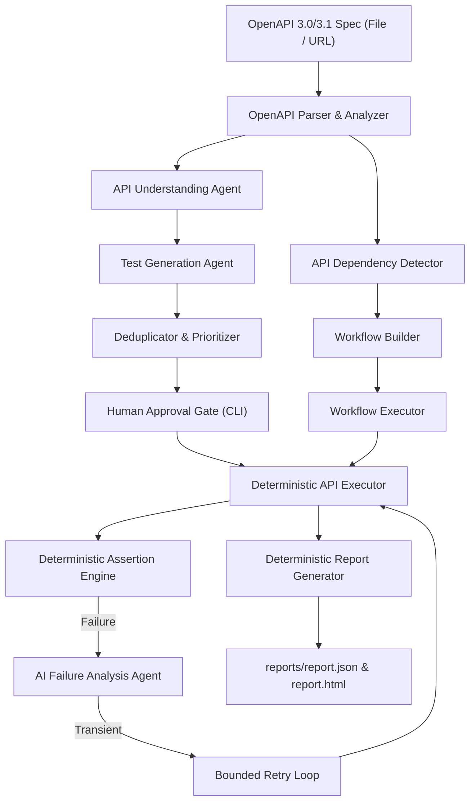

# AI API Testing Agent — Autonomous Exploratory QA

A production-grade, bounded AI testing agent designed to test RESTful APIs across different projects with **zero or minimal code changes**.

The system enforces a strict architectural invariant:
> **AI produces validated, structured data; deterministic Python code executes HTTP requests, runs assertions, extracts dynamic variables, and writes reports.**  
> Under no circumstances does an LLM generate or execute arbitrary Python code or shell scripts.

---

## Table of Contents

- [Overview & Architecture](#overview--architecture)
- [The Agents Explained](#the-agents-explained)
  - [1. API Understanding Agent](#1-api-understanding-agent)
  - [2. Test Generation Agent](#2-test-generation-agent)
  - [3. API Dependency Detector](#3-api-dependency-detector)
  - [4. Workflow Builder & Executor](#4-workflow-builder--executor)
  - [5. Failure Analysis Agent](#5-failure-analysis-agent)
  - [6. Bounded Agent Orchestrator](#6-bounded-agent-orchestrator)
- [How Anyone Can Use This in Their Project](#how-anyone-can-use-this-in-their-project)
  - [Step 1: Installation](#step-1-installation)
  - [Step 2: 60-Second Test Run (Zero Code, Zero Config)](#step-2-60-second-test-run-zero-code-zero-config)
  - [Step 3: Configuration Profile (For Auth & Custom Headers)](#step-3-configuration-profile-for-auth--custom-headers)
- [CLI Tools & Commands](#cli-tools--commands)
  - [1. Analyze Spec: `scripts/analyze_api.py`](#1-analyze-spec-scriptsanalyze_apipy)
  - [2. Generate Tests: `scripts/generate_tests.py`](#2-generate-tests-scriptsgenerate_testspy)
  - [3. Run Full Agent: `scripts/run_agent.py`](#3-run-full-agent-scriptsrun_agentpy)
- [Human Approval Mode vs CI/CD Automation](#human-approval-mode-vs-cicd-automation)
- [Interactive HTML & JSON Reports](#interactive-html--json-reports)
- [Safety, Security & Production Guardrails](#safety-security--production-guardrails)
- [Codebase Layout](#codebase-layout)
- [Verification & Testing](#verification--testing)

---

## Overview & Architecture

Writing and maintaining API tests manually is time-consuming and fragile: developers spend hours crafting Postman collections, hardcoding IDs, writing assertion scripts, and updating tests when endpoints change.

This agent automates the entire lifecycle:
1. Ingests any **OpenAPI / Swagger 3.0 or 3.1** specification (local file or live URL).
2. Deeply understands endpoint contracts, schema constraints, and edge cases.
3. Discovers producer-consumer relationships (e.g., login tokens, resource IDs).
4. Generates deduplicated, prioritized test batches (functional, negative, boundary).
5. Synthesizes and executes multi-step CRUD workflows with dynamic variable extraction.
6. Analyzes failures with root-cause classifications and confidence scores.
7. Produces self-contained, interactive HTML dashboard reports.



---

## The Agents Explained

The framework uses specialized agents that operate within strict Pydantic schema boundaries:

### 1. API Understanding Agent
- **File**: [`agents/api_understanding_agent.py`](file:///G:/api-testing-agent/agents/api_understanding_agent.py)
- **Role**: Analyzes parsed OpenAPI operations and deterministic schema facts to produce structured understanding records.
- **Output**: [`EndpointUnderstanding`](file:///G:/api-testing-agent/models/api_understanding.py) containing:
  - Operation purpose and business objective.
  - Required and optional input parameters (path, query, header, body).
  - Documented status codes and expected response fields.
  - Concrete negative scenarios (e.g. malformed body, missing required parameters).
  - Boundary conditions (e.g. max integer limit, empty strings).
  - Concise evidence-based reasoning summary.
- **Guardrail**: Caches analysis by endpoint SHA-256 hash to eliminate redundant LLM calls. Validates that returned method and path strictly match the source.

### 2. Test Generation Agent
- **File**: [`agents/test_generation_agent.py`](file:///G:/api-testing-agent/agents/test_generation_agent.py)
- **Role**: Transforms validated endpoint understanding into declarative test cases.
- **Output**: [`GeneratedTestBatch`](file:///G:/api-testing-agent/models/test_generation.py) containing validated [`TestCase`](file:///G:/api-testing-agent/models/test_case.py) objects.
- **Deterministic Deduplication**: [`TestDeduplicator`](file:///G:/api-testing-agent/ai/test_generator.py) hashes normalized request signatures (method, path, headers, query, body, assertions) to prune redundant tests regardless of wording.
- **Deterministic Prioritization**: [`TestPrioritizer`](file:///G:/api-testing-agent/ai/test_generator.py) transparently ranks tests by risk:
  1. Destructive operations (`DELETE`)
  2. Workflow dependencies
  3. Authentication dependencies
  4. Negative & boundary scenarios
  5. Functional happy paths

### 3. API Dependency Detector
- **File**: [`openapi/dependency_detector.py`](file:///G:/api-testing-agent/openapi/dependency_detector.py)
- **Role**: Discovers producer-consumer relationships between operations deterministically.
- **Capabilities**:
  - **Authentication Chains**: Detects endpoints producing session tokens (`POST /auth`, `POST /login`, `POST /oauth/token`) and binds the token to secured endpoints requiring headers (`Authorization: Bearer {{token}}` or `Cookie: token={{token}}`).
  - **Resource Lifecycles**: Matches creation endpoints (`POST /booking`) returning IDs (`bookingid`, `id`) with consumption endpoints (`GET /booking/{id}`, `PUT /booking/{id}`, `DELETE /booking/{id}`).
  - **Explainability**: Every detected dependency includes calibrated confidence (`0.75` to `0.95`) and concrete evidence citing OpenAPI schema paths.

### 4. Workflow Builder & Executor
- **Files**: [`agents/workflow_builder.py`](file:///G:/api-testing-agent/agents/workflow_builder.py) & [`executor/workflow_executor.py`](file:///G:/api-testing-agent/executor/workflow_executor.py)
- **Role**: Automatically synthesizes and executes end-to-end multi-step flows without writing custom test code.
- **Capabilities**:
  - **Automated Synthesis**: Assembles complete CRUD lifecycles: `Auth -> Create -> Retrieve -> Update -> Delete`.
  - **Dynamic Variable Extraction**: Extracts runtime values from response bodies using dot-notation (`bookingid`, `token`, `data.user.id`) or headers (`Set-Cookie`).
  - **Placeholder Resolution**: Resolves `{{variable}}` placeholders in subsequent request URLs, headers, query parameters, and JSON payloads.
  - **Cleanup Guarantees**: Steps marked `is_cleanup=True` (e.g. `DELETE`) are guaranteed to execute even if an intermediate step fails, ensuring the test environment remains clean.

### 5. Failure Analysis Agent
- **File**: [`agents/failure_analysis_agent.py`](file:///G:/api-testing-agent/agents/failure_analysis_agent.py)
- **Role**: Analyzes only failed or error executions to determine the root cause.
- **Taxonomy Classifications**:
  - `application_defect`: Unexpected 500 error or schema contract violation.
  - `authentication_issue`: Missing, expired, or invalid token (401/403).
  - `invalid_test_data`: Target entity missing or bad format (404/422).
  - `timeout` / `environment_issue`: Network or service unreachable.
  - `intermittent_failure`: Flaky or concurrency-related failures.
- **Guardrail**: Confidence is capped at `0.95`. Unknown classifications cannot exceed `0.50` confidence. Recommends concrete next investigative actions.

### 6. Bounded Agent Orchestrator
- **File**: [`agents/orchestrator.py`](file:///G:/api-testing-agent/agents/orchestrator.py)
- **Role**: Finite-state machine managing the entire test lifecycle.
- **Bounds**: Enforces hard limits on iterations, retries, and test counts. Retries are restricted exclusively to transient candidates (timeouts, transport errors, environment issues).
- **Decision Trace**: Every decision is logged in [`AgentState.decisions`](file:///G:/api-testing-agent/models/agent_state.py) with rationale, timestamp, and evidence.

---

## How Anyone Can Use This in Their Project

The agent is completely **spec-driven and configuration-driven**. It works with any API framework: FastAPI, Express, Django REST Framework, Spring Boot, Go Fiber, NestJS, ASP.NET Core, Rails, or Laravel.

### Step 1: Installation

```powershell
git clone <repo-url> api-testing-agent
cd api-testing-agent

# Create virtual environment
python -m venv .venv
.\.venv\Scripts\Activate.ps1

# Install dependencies
pip install -r requirements.txt
Copy-Item .env.example .env
```

### Step 2: 60-Second Test Run (Zero Code, Zero Config)

If your project serves an OpenAPI/Swagger document, test it immediately:

```powershell
# 1. Analyze your API and view detected dependencies
python scripts/analyze_api.py --spec http://localhost:8000/openapi.json

# 2. Run the agent autonomously with HTML report generation
python scripts/run_agent.py --spec http://localhost:8000/openapi.json --base-url http://localhost:8000 --auto-approve
```

The agent will:
1. Parse your API endpoints and schemas.
2. Generate negative, boundary, and functional test cases.
3. Automatically detect authentication and resource lifecycle dependencies.
4. Execute individual tests and multi-step workflows.
5. Analyze any failures and output a full HTML report at `reports/report.html`.

### Step 3: Configuration Profile (For Auth & Custom Headers)

For APIs that require specific authentication tokens, tenant headers, or seed variables, create a YAML profile (e.g. `my_service.yaml`):

```yaml
project_name: "Customer Order Service"
spec_path: "./swagger.json"           # or spec_url: "https://api.myproject.com/openapi.json"
base_url: "https://staging.myproject.com"
environment: "staging"                 # local, dev, staging, production
api_timeout: 15.0

# Global headers added to every request
default_headers:
  X-Tenant-ID: "tenant-001"
  Content-Type: "application/json"

# Automated authentication login step
auth:
  endpoint: "/api/v1/auth/login"
  method: "POST"
  payload:
    username: "qa-user"
    password: "password123"
  token_json_path: "data.token"        # JSON dot-path in login response
  token_header_name: "Authorization"   # Header to inject into secured requests
  token_header_prefix: "Bearer "

# Pre-seeded variables for request resolution
initial_variables:
  default_org_id: "org-100"

# Optional path filters (regex or substring)
include_endpoints:
  - "/api/v1/orders.*"
  - "/api/v1/customers.*"

# Workflow & Execution settings
max_tests: 30
max_iterations: 50
execute_workflows: true
auto_approve: true
```

Run the agent with your profile:
```powershell
python scripts/run_agent.py --config my_service.yaml
```

**Zero codebase changes needed!**

---

## CLI Tools & Commands

### 1. Analyze Spec: `scripts/analyze_api.py`
Inspects an OpenAPI spec, summarizes operations, inputs, and explainable dependencies:
```powershell
python scripts/analyze_api.py --spec examples/restful_booker/openapi.json
```
**Key Flags:**
- `--spec <path|url>`: Path or remote URL to OpenAPI 3.0/3.1 document.
- `--config <path>`: Project YAML/JSON configuration profile.
- `--verbose`, `-v`: Display optional parameters and evidence strings.
- `--json`: Output analysis as JSON for tooling integration.

### 2. Generate Tests: `scripts/generate_tests.py`
Generates, deduplicates, prioritizes, and saves test cases to disk:
```powershell
python scripts/generate_tests.py --spec examples/restful_booker/openapi.json --max-tests 25 --category functional
```
**Key Flags:**
- `--max-tests <int>`: Cap total number of tests to produce.
- `--category <name>`: Filter by `functional`, `negative`, `boundary`, `validation`, `workflow`.
- `--endpoint <path>`: Filter by endpoint path substring.
- `--output <path>`: Custom JSON destination (default: `test_data/generated/generated_tests.json`).

### 3. Run Full Agent: `scripts/run_agent.py`
Master CLI runner coordinating generation, execution, failure classification, workflows, and reports:
```powershell
python scripts/run_agent.py --spec examples/restful_booker/openapi.json [options]
```
**Key Flags:**
- `--spec <path|url>`: Path or URL to OpenAPI spec.
- `--base-url <url>`: Override target API server URL.
- `--environment [local|dev|staging|production]`: Target environment (default: `staging`).
- `--allow-production`: Explicit safety flag required to execute against production.
- `--auto-approve`, `-y`: Bypass human approval prompt for CI/CD automation.
- `--workflows` / `--no-workflows`: Toggle automated multi-step workflow execution.
- `--report-dir <path>`: Output directory for reports (default: `reports`).

---

## Human Approval Mode vs CI/CD Automation

### Interactive Human Approval Mode
By default, before executing any generated tests against a live server, the agent halts and renders an interactive summary table:

```text
[3/5] Test Plan Review & Human Approval Mode:
ID                             METHOD   ENDPOINT               CATEGORY     PRIORITY
--------------------------------------------------------------------------------
post-auth-neg-notfound         POST     /auth                  negative     medium
post-auth-happy                POST     /auth                  functional   high
get-booking-happy              GET      /booking               functional   high
post-booking-happy             POST     /booking               functional   high
get-booking-id-happy           GET      /booking/{id}          functional   high
put-booking-id-happy           PUT      /booking/{id}          functional   high
delete-booking-id-happy        DELETE   /booking/{id}          functional   high

Execute these 7 tests against https://restful-booker.herokuapp.com? [Y/n]: 
```
If you enter `n`, execution stops safely without touching the server.

### Headless CI/CD Automation Mode
Pass `--auto-approve` (or `-y`) to run headlessly in CI/CD pipelines (GitHub Actions, GitLab CI, Jenkins):
```powershell
python scripts/run_agent.py --spec openapi.json --auto-approve
```

---

## Interactive HTML & JSON Reports

Every run generates two audit artifacts under `reports/`:

### 1. Self-Contained HTML Dashboard (`reports/report.html`)
Open in any browser without internet access (no external CDN dependencies):
- **KPI Summary Cards**: Total Executed, Passed, Failed, Errors, Pass Rate %, Total Duration.
- **Category Breakdown**: Pass/fail distribution across functional, negative, boundary, and workflow tests.
- **Execution Details Table**: Method badges, endpoints, duration in ms, and assertion error messages.
- **AI Failure Analysis Cards**: Highlighting root causes (`authentication_issue`, `application_defect`, etc.), confidence percentages, and concrete next actions.
- **Workflow Traces**: Step-by-step lifecycle verification (`Auth -> Create -> Retrieve -> Update -> Delete`).

### 2. Structured JSON Summary (`reports/report.json`)
Machine-readable format containing raw requests, masked responses, durations, assertions, failure root-causes, and orchestrator decision traces.

---

## Safety, Security & Production Guardrails

1. **Deterministic Guardrails**:
   - LLMs only generate data conforming to strict Pydantic schemas (`extra="forbid"`).
   - Python code deterministically executes HTTP requests and assertions.
2. **Production Protection**:
   - Environment defaults to `staging`.
   - `production` execution is blocked unless `allow_production_execution=True` is explicitly passed.
3. **Sensitive Credential Redaction**:
   - All passwords, bearer tokens, API keys, cookies, and secret-shaped strings are masked as `***MASKED***` across logs, reports, and AI contexts.
4. **Offline Mock Mode**:
   - The built-in [`AutoMockLLMClient`](file:///G:/api-testing-agent/ai/auto_mock_client.py) enables 100% offline generation and testing without requiring third-party API keys.
   - Hosted LLMs (OpenAI, Ollama, Claude) can be connected seamlessly through standard HTTP adapters.

---

## Codebase Layout

```text
api-testing-agent/
├── agents/                   # Bounded reasoning agents
│   ├── api_understanding_agent.py   # Analyzes endpoint contracts & edge cases
│   ├── test_generation_agent.py     # Generates declarative test cases
│   ├── failure_analysis_agent.py    # Classifies failures with confidence & evidence
│   ├── workflow_builder.py          # Synthesizes CRUD workflows from dependencies
│   └── orchestrator.py              # Coordinates state machine and loop bounds
├── ai/                       # LLM abstraction & offline mock modes
│   ├── llm_client.py                # Provider-neutral interface
│   ├── auto_mock_client.py          # Deterministic offline test generator
│   └── test_generator.py            # Deduplicator & Prioritizer
├── clients/                  # Safe HTTP client with credential masking
│   └── api_client.py
├── config/                   # Settings, logging, & project profiles
│   ├── settings.py                  # Environment-backed runtime settings
│   ├── project_config.py            # YAML/JSON project profile loader
│   └── logging_config.py            # Structured logging with secret masking
├── executor/                 # Deterministic execution engine
│   ├── api_executor.py              # Variable resolution & request execution
│   ├── assertion_engine.py          # Status, JSON Schema, header, time assertions
│   └── workflow_executor.py         # Multi-step sequential workflow runner
├── models/                   # Strict Pydantic domain models (extra="forbid")
│   ├── api_models.py                # Normalized OpenAPI models
│   ├── dependency.py                # Producer, consumer, and dependency graph
│   ├── workflow.py                  # Multi-step workflow definitions
│   ├── test_case.py                 # Declarative test cases & assertions
│   ├── execution_models.py          # Results, sanitized request/response records
│   ├── failure_analysis.py          # Calibrated failure classifications
│   └── agent_state.py               # Serializable orchestrator state & decisions
├── openapi/                  # OpenAPI 3.0/3.1 parsing & dependency discovery
│   ├── parser.py                    # JSON/YAML parser with local $ref resolution
│   ├── analyzer.py                  # Deterministic endpoint fact extractor
│   └── dependency_detector.py       # Detects auth and resource lifecycle chains
├── reports/                  # Report generator (HTML dashboard & JSON)
│   └── report_generator.py
├── scripts/                  # CLI entrypoints
│   ├── analyze_api.py               # Spec analysis & dependency viewer
│   ├── generate_tests.py            # Test batch generation & storage
│   └── run_agent.py                 # Master autonomous test runner
├── examples/restful_booker/  # Working OpenAPI 3 reference implementation
│   └── openapi.json
└── tests/                    # 60 automated unit & integration tests
    ├── unit/
    └── integration/
```

---

## Verification & Testing

Run the full test suite (unit tests and integration tests with safe skip behavior):

```powershell
python -m pytest -p no:cacheprovider
```

**Latest verification status**: **60 passed** (100% pass rate).

## LLM Providers
The agent supports multiple LLM providers. You only need to set the `LLM_PROVIDER` environment variable and install the respective SDK if needed. No code changes are required.

Supported providers:
- `mock`: Default, for offline/testing. No SDK or API key needed.
- `openai`: Requires `pip install openai` and `LLM_API_KEY`.
- `anthropic`: Requires `pip install anthropic` and `LLM_API_KEY`.
- `gemini`: Requires `pip install google-generativeai` and `LLM_API_KEY`.
- `ollama`: For local models. No SDK or API key needed (uses `requests`). Requires `LLM_MODEL`.

Example for OpenAI:
```bash
LLM_PROVIDER=openai LLM_API_KEY=sk-... python scripts/run_agent.py --spec openapi.json
```

## Notifications
You can configure the agent to send test reports to Discord or Telegram when a run finishes.

**Discord:**
Set `DISCORD_WEBHOOK_URL` in your `.env` or project profile.

**Telegram:**
Set `TELEGRAM_BOT_TOKEN` and `TELEGRAM_CHAT_ID` in your `.env` or project profile.

By default, notifications are sent only if there are failures. Set `NOTIFY_ON_SUCCESS=true` to always send.
