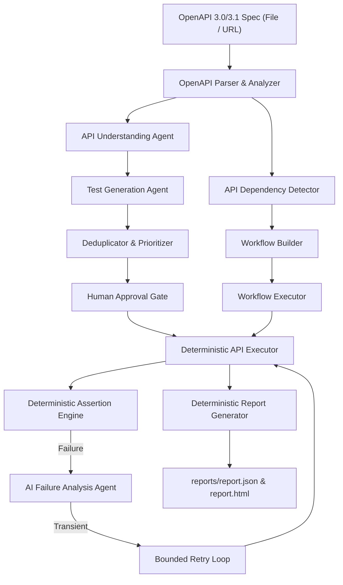
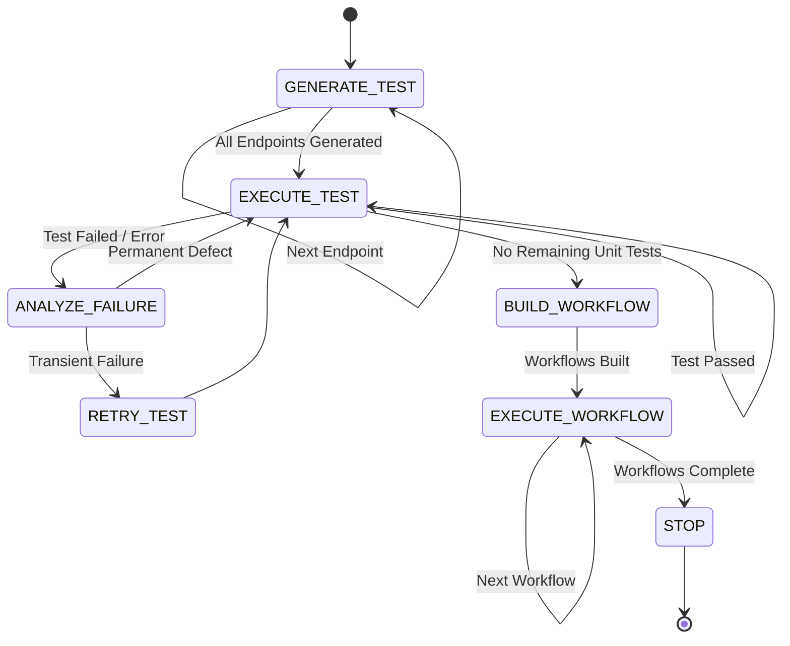

# AI API Testing Agent — System Architecture

## 1. Executive Summary

The **AI API Testing Agent** is an autonomous, reliable, and production-guarded API testing framework designed to test RESTful APIs across different projects with zero or minimal codebase changes.

The core design principle enforces a strict boundary:
**AI generates validated structured data; deterministic Python code executes HTTP requests, runs assertions, extracts dynamic variables, and writes reports.**
Under no circumstances does an LLM generate or execute arbitrary Python code or shell scripts.



---

## 2. Core Guardrails & Safety Invariants

1. **LLM Output is Data, Never Executable Code**:
   - All AI interactions pass through strictly typed Pydantic models with `extra="forbid"` and `strict=True`.
   - Any hallucinated fields, incorrect data types, or invalid formats trigger bounded correction retries and fail safely.
2. **Production Safety Guardrail**:
   - By default, environment is set to `staging`.
   - Execution against `production` requires explicit opt-in (`allow_production_execution=True` or `--allow-production`).
3. **Sensitive Data Redaction**:
   - Authentication tokens, passwords, bearer keys, and cookies are masked as `***MASKED***` before logging, storing in execution records, or submitting to LLM prompts.
4. **Strict Loop and Execution Bounds**:
   - Every agent loop enforces limits on `max_iterations`, `max_retries`, `max_generated_tests`, and `api_timeout`.
5. **Calibrated Confidence**:
   - Failure analysis confidence is capped at `0.95`. Unknown or unverified failures cannot exceed `0.50` confidence.

---

## 3. System Components & Responsibilities

### 3.1 OpenAPI Ingestion & Dependency Detection
- **`OpenAPIParser`** (`openapi/parser.py`):
  Parses local or remote OpenAPI 3.0/3.1 specifications (JSON/YAML) and resolves safe local `$ref` pointers with circular reference detection.
- **`OpenAPIAnalyzer`** (`openapi/analyzer.py`):
  Extracts deterministic facts about endpoints, required inputs, and status codes without AI interpretation.
- **`DependencyDetector`** (`openapi/dependency_detector.py`):
  Analyzes response schemas and parameter requirements across operations:
  - **Authentication Dependencies**: Identifies token producers (`POST /auth`, `POST /login`) and binds extracted tokens to endpoints requiring security.
  - **Resource Lifecycle Dependencies**: Connects resource creation (`POST /resource`) with read (`GET /resource/{id}`), update (`PUT/PATCH /resource/{id}`), and deletion (`DELETE /resource/{id}`).
  - **Association Dependencies**: Matches query, header, or body associations across domain entities.

### 3.2 Agent Layer
- **`APIUnderstandingAgent`** (`agents/api_understanding_agent.py`):
  Synthesizes evidence-grounded endpoint understanding, identifying purpose, negative scenarios, and boundary conditions. Identical endpoints are cached.
- **`TestGenerationAgent`** (`agents/test_generation_agent.py`):
  Generates declarative test batches covering functional, negative, and boundary scenarios.
- **`TestDeduplicator` & `TestPrioritizer`** (`ai/test_generator.py`):
  Removes logical duplicates by request signature (not wording) and prioritizes destructive operations, workflows, and negative tests.
- **`FailureAnalysisAgent`** (`agents/failure_analysis_agent.py`):
  Classifies execution failures into standard categories (`application_defect`, `authentication_issue`, `invalid_test_data`, `timeout`, `intermittent_failure`, etc.) with explicit evidence and recommended actions.
- **`AgentOrchestrator`** (`agents/orchestrator.py`):
  Coordinates generation, execution, failure analysis, retries, and workflow execution within an iteration budget.

### 3.3 Deterministic Execution Layer
- **`APIClient`** (`clients/api_client.py`):
  Safe HTTP client built on `requests` supporting GET, POST, PUT, PATCH, DELETE, timeouts, and masking.
- **`APIExecutor`** (`executor/api_executor.py`):
  Resolves dynamic `{{variable}}` placeholders in URL endpoints, headers, query params, and JSON bodies. Evaluates deterministic assertions.
- **`AssertionEngine`** (`executor/assertion_engine.py`):
  Validates status codes, field values, field types, headers, JSON Schema, and response time limits.
- **`WorkflowExecutor`** (`executor/workflow_executor.py`):
  Executes dependent multi-step workflows sequentially, extracts variables using dot-paths (`data.token`, `bookingid`), propagates values to later steps, and guarantees execution of cleanup steps (`is_cleanup=True`).

### 3.4 Multi-Project Reusability System
- **`ProjectConfig`** (`config/project_config.py`):
  Allows configuring any API project via YAML/JSON profile or CLI arguments:
  ```yaml
  project_name: "Customer Portal API"
  spec_path: "path/to/openapi.json" # or spec_url
  base_url: "https://staging.customer-api.test"
  environment: "staging"
  default_headers:
    X-Tenant-ID: "tenant-99"
  auth:
    endpoint: "/api/v1/auth"
    payload: {"username": "admin", "password": "password123"}
    token_json_path: "access_token"
  execute_workflows: true
  ```
- **CLI Commands**:
  - `python scripts/analyze_api.py --spec <file_or_url>`
  - `python scripts/generate_tests.py --spec <file_or_url>`
  - `python scripts/run_agent.py --spec <file_or_url>`

---

## 4. State Machine & Decision Trace

The orchestrator transitions between explicit actions:



Every transition is recorded in `AgentState.decisions` with timestamp, iteration, action, reasoning summary, and concrete evidence.

---

## 5. Reporting & Auditability

The framework produces two deterministic artifacts in `reports/`:
1. **`reports/report.json`**: Machine-readable JSON summary for CI/CD pipelines containing test counts, pass rates, durations, raw executions, failure root-causes, workflows, and decisions.
2. **`reports/report.html`**: A standalone, modern HTML report with dashboard cards, category breakdown, full execution tables, badges, failure analysis cards with next actions, and workflow progress. It requires no external internet connection or CDN scripts.
